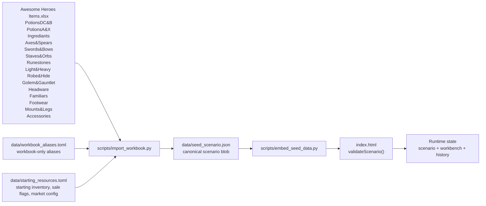

# Poshy Data Model

This document describes the shipped data model after phase 5 was implemented on March 9, 2026.

The authoritative implementations are:

- `scripts/import_workbook.py` for workbook parsing, aliasing, normalization, and JSON generation.
- `scripts/embed_seed_data.py` for syncing `data/seed_scenario.json` into `index.html`.
- `index.html` for strict scenario validation, runtime state validation, and browser editing behavior.
- `tests/test_import_workbook.py`, `tests/test_embed_seed_data.py`, and `tests/test_index_smoke.py` for schema and UI coverage.

## Source Of Truth

- The canonical persisted scenario shape is the JSON emitted by `scripts/import_workbook.py`.
- The upstream authored inputs are `Awesome Heroes Items.xlsx`, `data/workbook_aliases.toml`, and `data/starting_resources.toml`.
- The browser does not repair, alias, or canonicalize scenario data. It validates exact canonical data only.
- Potion subtype is still derived from recipe name and is never stored as a recipe field.
- Gem recipes are still generated from `"<Gem> piece"` ingredients.
- Equipment definitions are imported from workbook sheets; standalone equipment instances are authored in `data/starting_resources.toml`.
- Assembled ring and necklace combos are browser-authored runtime state stored on `EquipmentInstance.socketed_gems`.

## Pipeline



## Runtime Counts In The Current Seed

The current `data/seed_scenario.json` contains:

- `339` starting gold.
- `40` canonical ingredient names.
- `173` total starting ingredient units across `31` nonzero ingredient rows.
- `60` potion recipes.
- `20` generated gem recipes.
- `20` gem metadata entries.
- `353` equipment definitions.
- `4` starting equipment instances.
- `7` subtype metadata entries.
- `10` sellable ingredients.
- `12` sellable outputs.
- `4` sellable equipment definitions.

## Workbook Inputs

### Potion Sheets

The importer consumes `PotionsDC&B` and `PotionsA&X` for:

- potion recipes,
- potion tier text,
- potion effect text,
- subtype legend rows.

Recipe rows still require:

- a non-blank name in column `A`,
- a numeric gold price in column `C`,
- at least one parsed `Ingredient (Count)` cell in `D:G`,
- non-blank effect text in column `H`.

Subtype is still inferred from the output name:

- `brew of ` -> `brew`
- `elixir of ` -> `elixir`
- ` medicine` -> `medicine`
- ` potion` -> `potion`
- ` grenade` -> `grenade`
- ` toxin` -> `toxin`
- ` solution` -> `solution`

### `Ingrediants`

The importer still parses this sheet as price bands, not a normal row table.

- A price band starts when column `B` matches `<number> Gold` or `<number> G`.
- Ingredient names are then collected from columns `B`, `D`, `F`, `H`, and `J`.
- Only names already known from recipe ingredients are kept.
- Workbook aliases are applied before canonical lookup.

### `Accessories`

`Accessories` is now multi-pass input instead of a gem-metadata-only sheet.

The importer reads:

- gem metadata rows of the form `<Gem name> (<God>)`,
- ring base definitions,
- necklace base definitions,
- right-side shield blocks,
- right-side talisman blocks.

Imported accessory behavior:

- gem metadata still populates `gem_metadata`,
- rings and necklaces become socketable base equipment definitions,
- shields and talismans become standalone equipment definitions.

### Equipment Sheets

The importer now consumes all gear sheets:

- `Axes&Spears`
- `Swords&Bows`
- `Staves&Orbs`
- `Runestones`
- `Light&Heavy ` from the workbook, emitted as `category = "equipment"`
- `Robe&Hide`
- `Golem&Gauntlet`
- `Headware`
- `Familiars`
- `Footwear`
- `Mounts&Legs`
- `Accessories`

The parser is sheet-specific. It does not use one generic heuristic for every tab.

Coarse imported family slugs currently emitted are:

- `axe`
- `spear`
- `sword`
- `bow`
- `staff_orb`
- `orb`
- `runestone`
- `light_armor`
- `heavy_armor`
- `robe_armor`
- `hide_armor`
- `golem_armor`
- `gauntlet`
- `light_helm`
- `heavy_helm`
- `mage_helm`
- `golem_head`
- `familiar`
- `footwear`
- `mount`
- `golem_legs`
- `ring`
- `necklace`
- `shield`
- `talisman`

Special parsing rules already implemented:

- `Familiars` treat a named row as the start of one familiar record.
- Blank-name continuation rows, including rows beginning with `Abilities:` or workbook misspellings of that label, append additional familiar effects.
- `Accessories` emits canonical socket policy metadata only for rings and necklaces.

## TOML Authoring

### `data/workbook_aliases.toml`

This file still normalizes workbook spelling variants during import.

Shape:

```toml
[ingredients]
"Workbook spelling" = "Canonical ingredient name"

[outputs]
"Workbook spelling" = "Canonical output name"
```

Rules:

- aliases are workbook-import only,
- keys are case-insensitive after whitespace collapse,
- collisions are rejected,
- aliases are not accepted in `data/starting_resources.toml`.

### `data/starting_resources.toml`

This file now authors:

- starting gold,
- `market.sell_markdown`,
- base inventory for ingredients, potions, gems, and equipment,
- `for_sale` flags for ingredients, outputs, and equipment.

Shape:

```toml
gold = 339

[market]
sell_markdown = 0.5

[inventory.ingredients]
"Lune stone" = 18

[inventory.potions]
"Health potion" = 1

[inventory.gems]

[[inventory.equipment]]
id = "ring-bronze-1"
base_name = "Bronze ring"

[[inventory.equipment]]
id = "shield-basic-1"
base_name = "Basic Iron Shield"
current_hp = 7

[for_sale.ingredients]
"Lune stone" = true

[for_sale.outputs]
"Mana potion" = true

[for_sale.equipment]
"Bronze ring" = true
"Basic Iron Shield" = true
```

Rules:

- `gold` must not be negative.
- `market.sell_markdown` defaults to `0.5` and must stay within `0..1`.
- inventory counter maps use canonical names only.
- `inventory.equipment` is authored as explicit instance tables, not counts.
- each equipment instance needs `id` and `base_name`.
- `current_hp` is required in TOML when the definition has numeric `max_hp`.
- `current_hp` is omitted in TOML for definitions whose `max_hp` is `null`; the importer emits `current_hp: null` in canonical JSON.
- `socketed_gems` is not currently authored in `data/starting_resources.toml`; phase 4 combo state is browser-authored.
- duplicate equipment ids are rejected.
- unknown equipment names in `inventory.equipment` or `for_sale.equipment` are rejected.
- workbook aliases are not accepted here.

## Canonical Scenario Type Model

```ts
type IngredientName = string;
type OutputName = string;
type IngredientType = "herb" | "gem_piece";
type RecipeKind = "potion" | "gem";
type PotionTier = "A" | "B" | "C" | "D";
type FlagMap = Record<string, true>;
type CounterMap = Record<string, number>;

interface MarketConfig {
  sell_markdown: number;
}

interface EquipmentSocketPolicy {
  min_gems: number;
  max_gems: number;
  imbue_fee: number;
}

interface EquipmentDefinition {
  name: string;
  family: string;
  category: "equipment" | "accessory";
  rank: string;
  buy_price: number;
  max_hp: number | null;
  stats: Record<string, string>;
  effects: string[];
  optimizer_auto_sell: boolean;
  socket_policy?: EquipmentSocketPolicy;
}

interface EquipmentInstance {
  id: string;
  base_name: string;
  current_hp: number | null;
  socketed_gems?: string[];
}

interface Inventory {
  gold: number;
  ingredients: CounterMap;
  potions: CounterMap;
  gems: CounterMap;
  equipment: EquipmentInstance[];
}

interface GemMetadata {
  color: string;
  god: string;
  accessory_effects: string[];
}

interface PotionRecipe {
  name: OutputName;
  kind: "potion";
  tier: PotionTier;
  price: number | null;
  ingredients: CounterMap;
  effect_text: string;
}

interface GemRecipe {
  name: OutputName;
  kind: "gem";
  ingredients: CounterMap;
}

interface Scenario {
  market: MarketConfig;
  inventory: Inventory;
  ingredient_prices: Record<IngredientName, number>;
  ingredient_types: Record<IngredientName, IngredientType>;
  gem_metadata: Record<OutputName, GemMetadata>;
  equipment: {
    definitions: Record<string, EquipmentDefinition>;
  };
  for_sale: {
    ingredients: FlagMap;
    outputs: FlagMap;
    equipment: FlagMap;
  };
  subtypes: Record<string, { label: string; action_text: string; targeting_text: string }>;
  recipes: {
    recipes: Array<PotionRecipe | GemRecipe>;
  };
}
```

## Equipment Definition Conventions

The importer currently normalizes every equipment definition to:

```json
{
  "name": "Bronze ring",
  "family": "ring",
  "category": "accessory",
  "rank": "A",
  "buy_price": 40,
  "max_hp": null,
  "stats": {},
  "effects": ["+1 STR cap", "-1 SKI cap"],
  "optimizer_auto_sell": false,
  "socket_policy": {
    "min_gems": 0,
    "max_gems": 1,
    "imbue_fee": 50
  }
}
```

Conventions already enforced by the importer and runtime validator:

- `name` must match the definition-map key.
- `category` is `"accessory"` for rings, necklaces, and talismans, otherwise `"equipment"`.
- `rank` is normalized to the leading workbook tier letter.
- `buy_price` and `max_hp` are numeric in canonical JSON.
- `max_hp` is `null` for items such as rings, necklaces, and talismans.
- `stats` is a lossless string map keyed by canonical snake_case labels derived from workbook headers.
- `effects` is an ordered list of non-empty trimmed strings.
- `optimizer_auto_sell` defaults to `false` for every imported equipment definition.
- `socket_policy` exists only for rings and necklaces.

Current socket policy conventions:

- rings: `{ min_gems: 0, max_gems: 1, imbue_fee: 50 }`
- necklaces: `{ min_gems: 1, max_gems: 3, imbue_fee: 50 }`
- unsocketed rings and necklaces omit `socketed_gems`
- socketed ring and necklace instances require `socketed_gems` length `1..max_gems`
- duplicate gem names inside one combo are allowed

Phase 4 creates assembled ring and necklace combos at runtime and persists them through saved browser state and exported/imported scenario JSON.

## Scenario JSON Shape

Representative fragment from the current generated seed:

```json
{
  "market": {
    "sell_markdown": 0.5
  },
  "inventory": {
    "gold": 339,
    "ingredients": {
      "Lune stone": 18,
      "Agate piece": 0
    },
    "potions": {
      "Blessed medicine": 1,
      "Health potion": 1
    },
    "gems": {},
    "equipment": [
      {
        "id": "ring-bronze-1",
        "base_name": "Bronze ring",
        "current_hp": null
      },
      {
        "id": "shield-basic-1",
        "base_name": "Basic Iron Shield",
        "current_hp": 7
      }
    ]
  },
  "equipment": {
    "definitions": {
      "Bronze ring": {
        "name": "Bronze ring",
        "family": "ring",
        "category": "accessory",
        "rank": "A",
        "buy_price": 40,
        "max_hp": null,
        "stats": {},
        "effects": ["+1 STR cap", "-1 SKI cap"],
        "optimizer_auto_sell": false,
        "socket_policy": {
          "min_gems": 0,
          "max_gems": 1,
          "imbue_fee": 50
        }
      },
      "Basic Iron Shield": {
        "name": "Basic Iron Shield",
        "family": "shield",
        "category": "equipment",
        "rank": "C",
        "buy_price": 30,
        "max_hp": 7,
        "stats": {},
        "effects": [
          "Shield block",
          "Increases shield by 1",
          "-2 climb cap",
          "Opponents accuracy increased by 2"
        ],
        "optimizer_auto_sell": false
      }
    }
  },
  "for_sale": {
    "ingredients": {
      "Lune stone": true
    },
    "outputs": {
      "Mana potion": true
    },
    "equipment": {
      "Bronze ring": true,
      "Basic Iron Shield": true
    }
  }
}
```

Phase 4 does not change the generated seed fragment above. Runtime-authored or imported scenario JSON may additionally include `socketed_gems` on ring and necklace instances.

## Runtime Validation And Persisted State

`index.html` validates:

- imported scenario JSON,
- locally persisted `scenario`,
- locally persisted `workbench`,
- persisted history transaction payloads.

Workbench state still mirrors inventory shape:

```json
{
  "gold": 339,
  "ingredients": {},
  "potions": {},
  "gems": {},
  "equipment": []
}
```

History entries still use `before`, `after`, and `effect.transactions`.

Validated transaction kinds remain:

- `gold`
- `stackable`
- `equipment`

Ingredient market buys still use `stackable` transactions with `bucket = "ingredients"` and `unit_price`; the browser distinguishes manual buys from craft auto-buys by the transaction `reason` string rather than by a new persisted transaction shape. Phase 5 stackable sells likewise stay on `stackable` transactions and use `reason = "sell ingredient"` or `reason = "sell output"` instead of adding another transaction kind.

Equipment instances in persisted scenario and workbench state must always carry canonical JSON shape:

- `id`
- `base_name`
- `current_hp`
- optional `socketed_gems`

Even when an authored TOML instance omits `current_hp` for a `max_hp = null` item, the generated JSON and runtime state store `current_hp: null`.

Runtime rules for `socketed_gems` now enforced by the browser validator:

- only equipment definitions with `socket_policy` may carry `socketed_gems`,
- each socketed gem name must be a known gem recipe name,
- `socketed_gems` must contain at least one gem when present,
- `socketed_gems` must not exceed `socket_policy.max_gems`,
- duplicate gem names are allowed.

Because phase 4 combo state lives on the existing `EquipmentInstance` shape, saved browser state, exported/imported JSON, and `Set Base From Workbench` all preserve assembled accessories without schema changes.

## Browser Surfaces Shipped Through Phase 5

The single-file browser app now exposes runtime state in these places:

- Workbench category tabs: `Potions`, `Gems`, `Herbs`, `Gem Pieces`, `Equipment`, and `Accessories`.
- Workbench recipe tabs: potion and gem cards still use the shared craft/buy simulator and focus-chip filtering.
- Workbench ingredient tabs: weekly sold herbs and gem pieces can be bought directly into the live run.
- Workbench equipment tabs: equipment and accessory listings are split by explicit `category`, with rings, necklaces, and talismans in `Accessories` and shields in `Equipment`.
- Workbench holdings tables for herbs, gem pieces, potions, and gems now show sell values and per-unit sell actions, with a stacked mobile row layout at narrow widths instead of a cramped five-column table.
- Workbench holdings: standalone gear is split into `Equipment` and `Accessories`, rendered as compact cards without visible instance ids, with socket summaries for assembled combos and sell actions that include socketed gem value.
- Item inspector: outputs, ingredients, equipment definitions, and owned equipment instances can all be inspected from the workbench, holdings, and action log, and stackable detail cards now show current sell value.
- Workbench accessory cards: owned rings and necklaces can assemble or disassemble combos directly in the `Accessories` tab, while the inspector remains read-only for current sockets and sell-value breakdowns.
- Action log: transaction history exposes inspect links for outputs, ingredients, and equipment definitions, including stackable sell actions and accessory combo `equipment update` actions.
- Run summary stats: equipment count is shown alongside gold, ingredients, potions, and gems.
- Base Inventory tab: add, edit, remove standalone equipment instances without exposing generated instance ids.
- Shop tab: toggle weekly `for_sale.equipment` availability.
- Catalog tab: read-only equipment definition details with editable `optimizer_auto_sell`.

This shipped UI still does not yet expose:

- planner/optimization tools,
- dedicated Base Inventory or Shop editors for `socketed_gems`.

## Validation And Failure Modes

The importer and runtime already reject these important failure cases:

- missing required workbook sheets,
- duplicate recipe names after alias normalization,
- potion names that do not map to a supported subtype pattern,
- missing potion effect text,
- missing parsed recipe ingredients,
- missing ingredient price coverage,
- missing gem metadata for a generated gem,
- duplicate gem metadata rows,
- malformed accessory parsing that references unknown gems,
- unknown canonical names in `data/starting_resources.toml`,
- workbook alias names used directly in `data/starting_resources.toml`,
- duplicate `inventory.equipment` ids,
- unknown `inventory.equipment[*].base_name` values,
- missing `current_hp` for HP-bearing equipment authored in TOML,
- `current_hp` outside `0..max_hp` for HP-bearing equipment,
- `socketed_gems` on equipment without `socket_policy`,
- empty `socketed_gems` arrays,
- `socketed_gems` longer than the accessory socket cap,
- unknown gem names inside `socketed_gems`,
- invalid `for_sale.equipment` names,
- malformed equipment definitions in imported JSON,
- malformed equipment instances in imported or persisted JSON,
- imported browser JSON using alias names or misbucketed outputs,
- persisted browser history using legacy pre-transaction `effect` payloads.

## Practical Guidance

- Join on canonical names, never workbook spellings.
- Treat `recipes.recipes` as the authoritative output catalog.
- Treat `equipment.definitions` as imported catalog data, not user-authored browser state.
- Use `ingredient_types` instead of string suffix checks in new UI or analysis code.
- Preserve `EquipmentInstance.id` as stable instance identity; do not derive gameplay meaning from it beyond uniqueness.
- Treat `socketed_gems` as runtime-authored combo state; do not extend `data/starting_resources.toml` with it unless the importer is also updated.
- Runtime gold can become fractional after HP-aware equipment sells; format it for display instead of assuming integers.
- If you need the browser definition of an accessory, use `category === "accessory"` rather than workbook-sheet inference or a family allowlist.
- If you add new equipment behavior, decide first whether it belongs in:
  - workbook import,
  - `data/starting_resources.toml`,
  - generated scenario JSON,
  - or runtime-only workbench state.
