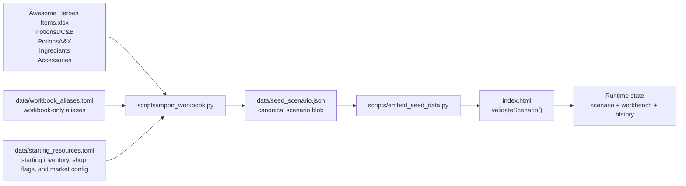
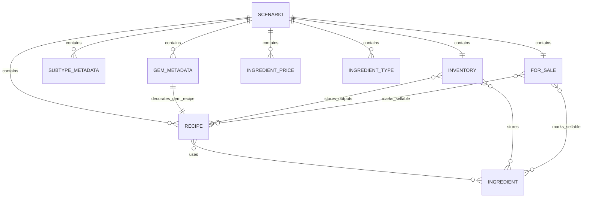

# Poshy Data Model

This document describes the precise data model used by the current project across the full authoring pipeline:

1. The source workbook `Awesome Heroes Items.xlsx`.
2. The import-side TOML files in `data/`.
3. The generated scenario JSON blob in `data/seed_scenario.json`.
4. The embed step that splices that JSON into `index.html`.
5. The browser runtime strict validation in `index.html`.

The authoritative implementations are:

- `scripts/import_workbook.py` for workbook parsing, aliasing, validation, and JSON generation.
- `scripts/embed_seed_data.py` for refreshing the marked embedded JSON block inside `index.html`.
- `index.html` for strict runtime validation of the scenario blob and persisted browser state.
- `tests/test_import_workbook.py` for importer schema assertions.

## Source Of Truth

Use these rules when building new features:

- The canonical persisted scenario shape is the JSON shape emitted by `scripts/import_workbook.py`.
- The canonical upstream inputs are the workbook plus `data/workbook_aliases.toml` and `data/starting_resources.toml`.
- The browser no longer aliases, canonicalizes, or repairs scenario data. It validates exact canonical data only.
- Recipe subtype is never stored explicitly in a recipe. It is always derived from the recipe name.
- Gem recipes are generated, not authored directly in the workbook.

## Pipeline



## Core Entities



## Runtime Counts In The Current Seed

The current `data/seed_scenario.json` contains:

- 1 market config entry.
- 40 canonical ingredients.
- 60 potion recipes.
- 20 gem recipes.
- 20 gem metadata entries.
- 0 equipment definitions.
- 0 starting equipment instances.
- 7 subtype metadata entries.
- 10 sellable ingredients.
- 12 sellable outputs.
- 0 sellable equipment definitions.

## Canonical Type Model

This is the effective feature-development model for the generated scenario:

```ts
type IngredientName = string;
type OutputName = string;
type IngredientType = "herb" | "gem_piece";
type RecipeKind = "potion" | "gem";
type PotionSubtype =
  | "medicine"
  | "elixir"
  | "potion"
  | "toxin"
  | "solution"
  | "grenade"
  | "brew";
type PotionTier = "A" | "B" | "C" | "D";

type CounterMap = Record<string, number>;
type FlagMap = Record<string, true>;

interface MarketConfig {
  sell_markdown: number;
}

interface EquipmentInstance {
  id: string;
  base_name: string;
  current_hp: number | null;
  socketed_gems?: string[];
}

interface Inventory {
  gold: number;
  ingredients: CounterMap;
  potions: CounterMap;
  gems: CounterMap;
  equipment: EquipmentInstance[];
}

interface SubtypeMetadata {
  label: string;
  action_text: string;
  targeting_text: string;
}

interface PotionRecipe {
  name: OutputName;
  kind: "potion";
  tier: PotionTier;
  price: number;
  ingredients: CounterMap;
  effect_text: string;
}

interface GemRecipe {
  name: OutputName;
  kind: "gem";
  ingredients: CounterMap;
}

interface GemMetadata {
  color: string;
  god: string;
  accessory_effects: string[];
}

interface EquipmentDefinition {
  name: string;
  family: string;
  source_sheet: string;
  rank: string;
  buy_price: number;
  max_hp: number | null;
  stats: Record<string, unknown>;
  effects: string[];
  optimizer_auto_sell: boolean;
  socket_policy?: Record<string, unknown>;
}

type Transaction =
  | { kind: "gold"; delta: number; reason: string }
  | {
      kind: "stackable";
      bucket: "ingredients" | "potions" | "gems";
      name: string;
      delta: number;
      reason: string;
      unit_price?: number;
    }
  | {
      kind: "equipment";
      action: "add" | "remove" | "update";
      instance: EquipmentInstance;
      previous?: EquipmentInstance;
      reason: string;
    };

interface WorkbenchState {
  gold: number;
  ingredients: CounterMap;
  potions: CounterMap;
  gems: CounterMap;
  equipment: EquipmentInstance[];
}

interface HistoryEntry {
  label: string;
  before: WorkbenchState;
  after: WorkbenchState | null;
  effect: { transactions: Transaction[] } | null;
}

interface Scenario {
  market: MarketConfig;
  inventory: Inventory;
  ingredient_prices: Record<IngredientName, number>;
  ingredient_types: Record<IngredientName, IngredientType>;
  gem_metadata: Record<OutputName, GemMetadata>;
  equipment: {
    definitions: Record<string, EquipmentDefinition>;
  };
  for_sale: {
    ingredients: FlagMap;
    outputs: FlagMap;
    equipment: FlagMap;
  };
  subtypes: Record<PotionSubtype, SubtypeMetadata>;
  recipes: {
    recipes: Array<PotionRecipe | GemRecipe>;
  };
}
```

## Canonical Naming Rules

Names are the join keys across the whole project.

- Ingredient names are canonical strings such as `Green herb` or `Agate piece`.
- Output names are canonical strings such as `Health potion`, `Blessed medicine`, or `Agate`.
- The importer normalizes workbook spellings through `data/workbook_aliases.toml`.
- `data/starting_resources.toml` must use canonical names, not workbook aliases.
- Outside the importer, names are matched exactly as stored. The browser runtime does not case-fold, alias, or canonicalize names.

Examples of workbook-only aliases from `data/workbook_aliases.toml`:

```toml
[ingredients]
"Green Herb" = "Green herb"
"Dragonscale" = "Dragon scale"
"Citrine shard" = "Citrine piece"
"Ibsidion shard" = "Ibsidian shard"

[outputs]
"Dark toxin" = "Dark Toxin"
"Elixir of Invisibility" = "Elixir of invisibility"
"Miracl medicine" = "Miracle medicine"
```

## Workbook Schema

Only four workbook sheets are consumed by the importer:

- `PotionsDC&B`
- `PotionsA&X`
- `Ingrediants`
- `Accessories`

Other sheets and most unrelated columns are ignored.

### `PotionsDC&B` and `PotionsA&X`

These sheets provide potion recipes and subtype legend text.

#### Consumed columns

| Column | Meaning | Required for recipe rows | Notes |
| --- | --- | --- | --- |
| `A` | Potion name or subtype label | Yes | Used for recipe name and for subtype legend rows. |
| `B` | Rank text or subtype action text | Yes | Rank parser takes the leading capital letter only. |
| `C` | Gold price | Yes | Must be digits only for a row to count as a recipe. |
| `D` | Ingredient slot 1 | No | Parsed only if cell matches `Name (Count)`. |
| `E` | Ingredient slot 2 or subtype targeting text | No | Same ingredient parsing rule; legend rows use it for targeting text. |
| `F` | Ingredient slot 3 | No | Parsed only if cell matches `Name (Count)`. |
| `G` | Ingredient slot 4 | No | Parsed only if cell matches `Name (Count)`. Non-matching values are ignored. |
| `H` | Effect text | Yes | Required for recipe rows. |

#### Recipe row detection

A row is imported as a potion recipe only when all of these are true:

- Column `A` is non-blank after whitespace collapse.
- Column `C` is non-blank and contains digits only.
- At least one of `D`, `E`, `F`, `G` parses as `Name (Count)`.
- Column `H` is non-blank.

Everything else on these sheets is ignored.

#### Rank parsing

The importer uses the first capital letter in column `B` as the tier:

- `D 4/4` -> `D`
- `B 1/2` -> `B`
- `A 0/1` -> `A`

Importer parser behavior:

- Accepted letters in `scripts/import_workbook.py`: `A`, `B`, `C`, `D`, `X`.

Browser runtime behavior:

- `index.html` rejects potion recipes with tier `X`.

For new features, treat potion tiers as `A | B | C | D`.

#### Subtype derivation

Potion subtype is inferred from the recipe name. It is not stored on the recipe object.

| Pattern | Derived subtype |
| --- | --- |
| `^brew of ` | `brew` |
| `^elixir of ` | `elixir` |
| ` medicine$` | `medicine` |
| ` potion$` | `potion` |
| ` grenade$` | `grenade` |
| ` toxin$` | `toxin` |
| ` solution$` | `solution` |

Any potion name that does not match one of those patterns is rejected.

#### Subtype legend rows

The importer also scans both potion sheets for these labels in column `A`:

- `Medicine`
- `Elixir`
- `Potion`
- `Toxin`
- `Solution`
- `Grenade`
- `Brew`

For each matching row:

- `A` -> subtype label
- `B` -> `action_text`
- `E` -> `targeting_text`

Both potion sheets must define the same legend content.

#### Example recipe rows

```text
PotionsDC&B row 14
A: Health potion
B: D 4/4
C: 55
D: Green herb (2)
E: Cactus pulp (2)
H: Gain 4 HP
```

```text
PotionsA&X row 23
A: Dark Toxin
B: A 0/1
C: 195
D: Nappa grass (5)
E: Wano honey (3)
F: Runic bone (1)
G: Amethyst piece (2)
H: Dooms all damaged enemies for the next 5 turns
```

```text
Potion subtype legend row
A: Elixir
B: 1 passive action
E: can use on adjacent allies
```

### `Ingrediants`

This sheet is not parsed as a normal row table. It is parsed as repeated price bands with ingredient name cells embedded in a layout block.

#### Consumed cells and rules

- A price band starts when column `B` matches `<number> Gold`.
- While a price band is active, ingredient names are collected from columns `B`, `D`, `F`, `H`, and `J`.
- The current workbook uses price bands `10 Gold`, `15 Gold`, `20 Gold`, and `25 Gold`.
- Only names already known from potion recipe ingredients are kept.
- Names ending in a single-letter suffix after `piece` are normalized:
  - `Peridot piece A` -> `Peridot piece`
  - `Topaz piece U` -> `Topaz piece`
- Workbook ingredient aliases are applied here before canonical lookup.

Ignored values include:

- Repeated price markers such as `20 Gold`
- Single-letter cells such as `D`
- The sheet title `Ingrediants`
- Any non-canonical name that is not resolved by aliases

#### Example price-band block

```text
Row 36, column B: 20 Gold
Row 37, columns B/D/F/H/J:
  Peridot piece A
  Agate piece C
  Citrine piece A
  Garnet piece A
  Moonstone piece A
```

That block yields five `ingredient_prices` entries, all priced at `20`.

### `Accessories`

This sheet provides gem metadata only. It does not define gem recipes.

#### Row detection

A row is imported as gem metadata only when column `A` matches:

```text
<Gem name> (<God>)
```

If the gem name does not match a generated gem recipe name after output alias normalization, import fails.

#### Consumed columns

| Column | Meaning | Required |
| --- | --- | --- |
| `A` | Gem name plus god in parentheses | Yes |
| `C` | Accessory effect line 1 | At least one of `C`, `D`, `E` must be non-blank |
| `D` | Accessory effect line 2 | No |
| `E` | Accessory effect line 3 | No |
| `F` | Gem color | Yes |

Other columns on this sheet are ignored by the importer.

#### Example metadata row

```text
Accessories row 27
A: Lapis lazuli (Fenroc)
C: resist heat
D: Lavawalking
E: Icewalking
F: Torquoise
```

This becomes:

```json
{
  "Lapis lazuli": {
    "color": "Torquoise",
    "god": "Fenroc",
    "accessory_effects": ["resist heat", "Lavawalking", "Icewalking"]
  }
}
```

## TOML Schemas

There are two active import-side TOML files.

### `data/workbook_aliases.toml`

Purpose:

- Normalize workbook spelling variants to canonical names during import.

Shape:

```toml
[ingredients]
"Workbook spelling" = "Canonical ingredient name"

[outputs]
"Workbook spelling" = "Canonical output name"
```

Rules:

- Keys and values are strings.
- Blank keys are rejected.
- Blank target values are rejected.
- Aliases are case-insensitive on the key side after whitespace collapse.
- Colliding aliases that resolve the same normalized key to different targets are rejected.
- Ingredient aliases apply to:
  - potion ingredient cells
  - ingredient price sheet names
- Output aliases apply to:
  - potion recipe names
  - accessory sheet gem names
- Aliases do not apply to `data/starting_resources.toml`.

Example:

```toml
[ingredients]
"Agate" = "Agate piece"
"Lapis Lazuli" = "Lapis lazuli piece"
"Dragonscale" = "Dragon scale"

[outputs]
"Dark toxin" = "Dark Toxin"
"Elixir of Space" = "Elixir of space"
"Miracl medicine" = "Miracle medicine"
```

### `data/starting_resources.toml`

Purpose:

- Define starting gold.
- Define market defaults used by runtime sell-value helpers.
- Define starting inventory.
- Define which ingredients and outputs are available for sale.

Shape:

```toml
gold = 339

[market]
sell_markdown = 0.5

[inventory.ingredients]
"Ingredient name" = 0

[inventory.potions]
"Potion output name" = 1

[inventory.gems]
"Gem output name" = 0

[for_sale.ingredients]
"Ingredient name" = true

[for_sale.outputs]
"Output name" = true
```

Rules:

- `gold` is required in practice and is coerced to an integer by the importer.
- `market.sell_markdown` defaults to `0.5` when omitted and must be between `0` and `1`.
- Negative gold is rejected.
- Inventory counts are coerced with `int(...)`.
- Negative counts are rejected.
- Names must already exist in the imported recipe universe.
- Workbook aliases are not accepted here.
- `inventory.potions` and `inventory.gems` both use output names.
- Equipment inventory is not authored in TOML yet; phase 1 emits `inventory.equipment = []`, `for_sale.equipment = {}`, and `equipment.definitions = {}` automatically.
- `for_sale.outputs` may reference any canonical output name, including gems, although current seed data only marks potions for sale.
- Falsey sale entries are ignored and omitted from the JSON output.

Example:

```toml
gold = 339

[market]
sell_markdown = 0.5

[inventory.ingredients]
"Lune stone" = 18
"Green herb" = 4
"Agate piece" = 0

[inventory.potions]
"Blessed medicine" = 1
"Health potion" = 1

[inventory.gems]

[for_sale.ingredients]
"Lune stone" = true
"Agate piece" = true

[for_sale.outputs]
"Warming medicine" = true
"Dark Toxin" = true
"Brew of the Master" = true
```

## Scenario JSON Schema

The browser runtime validates this shape exactly. Invalid imported JSON is rejected, and invalid persisted browser state blocks startup until the user clears local data.

The importer produces a single scenario blob with this top-level shape:

```json
{
  "market": {
    "sell_markdown": 0.5
  },
  "inventory": { "...": "..." },
  "ingredient_prices": { "...": 10 },
  "ingredient_types": { "...": "herb" },
  "gem_metadata": { "...": { "...": "..." } },
  "equipment": {
    "definitions": {}
  },
  "for_sale": {
    "ingredients": { "...": true },
    "outputs": { "...": true },
    "equipment": {}
  },
  "subtypes": { "...": { "...": "..." } },
  "recipes": {
    "recipes": []
  }
}
```

### `market`

Shape:

```json
{
  "sell_markdown": 0.5
}
```

Rules:

- `sell_markdown` is a non-negative number and must not exceed `1`.
- Runtime sell-value helpers use this scalar for ingredients, outputs, and future equipment resale.
- Phase 1 intentionally uses one global markdown instead of per-category settings.

### `inventory`

Shape:

```json
{
  "gold": 339,
  "ingredients": {
    "Lune stone": 18,
    "Agate piece": 0
  },
  "potions": {
    "Blessed medicine": 1
  },
  "gems": {},
  "equipment": []
}
```

Rules:

- `gold` is a non-negative number in the browser and an integer in generated JSON.
- `ingredients` maps ingredient names to counts.
- `potions` maps potion output names to counts.
- `gems` maps gem output names to counts.
- `equipment` stores unique equipment instances, not counts.
- Counts are canonical non-negative integers in generated JSON.
- The browser validates these buckets exactly and rejects misbucketed or malformed persisted/imported data instead of repairing it.

### `equipment`

Shape:

```json
{
  "definitions": {}
}
```

Rules:

- `definitions` is keyed by equipment definition name.
- Phase 1 seed data ships with an empty map, but the browser already validates the future definition shape.
- Each definition must contain:
  - `name`
  - `family`
  - `source_sheet`
  - `rank`
  - `buy_price`
  - `max_hp`
  - `stats`
  - `effects`
  - `optimizer_auto_sell`
- `socket_policy` is optional and must be an object when present.

### `ingredient_prices`

Shape:

```json
{
  "Green herb": 10,
  "Agate piece": 20,
  "Dragon scale": 25
}
```

Rules:

- Must contain every ingredient name that appears anywhere in inventory or recipes.
- Values are non-negative numbers.
- Generated JSON uses integers.

### `ingredient_types`

Shape:

```json
{
  "Green herb": "herb",
  "Agate piece": "gem_piece"
}
```

Rules:

- Must contain every ingredient name that appears anywhere in inventory or recipes.
- Allowed values are only `herb` and `gem_piece`.
- Importer derives this map automatically:
  - names ending with ` piece` -> `gem_piece`
  - everything else -> `herb`

### `gem_metadata`

Shape:

```json
{
  "Agate": {
    "color": "Violet",
    "god": "golem +",
    "accessory_effects": [
      "gain 2MP every turn you don't cast a spell"
    ]
  }
}
```

Rules:

- Keyed by gem recipe name.
- Must contain exactly one entry for every gem recipe.
- Must not contain entries for non-gem outputs.
- `accessory_effects` is a non-empty array of non-blank strings in generated JSON.

### `for_sale`

Shape:

```json
{
  "ingredients": {
    "Agate piece": true,
    "Lune stone": true
  },
  "outputs": {
    "Dark Toxin": true,
    "Warming medicine": true
  },
  "equipment": {}
}
```

Rules:

- `ingredients` is keyed by ingredient name.
- `outputs` is keyed by output name.
- `equipment` is keyed by equipment definition name.
- Values are stored as literal `true`.
- Missing keys mean "not for sale".

### `subtypes`

Shape:

```json
{
  "medicine": {
    "label": "Medicine",
    "action_text": "Reactive",
    "targeting_text": ""
  },
  "elixir": {
    "label": "Elixir",
    "action_text": "1 passive action",
    "targeting_text": "can use on adjacent allies"
  }
}
```

Rules:

- All seven subtype keys are required:
  - `medicine`
  - `elixir`
  - `potion`
  - `toxin`
  - `solution`
  - `grenade`
  - `brew`
- No additional subtype keys are allowed.
- Values come from the workbook subtype legend rows.

### `recipes.recipes`

This array is a tagged union of potion recipes and gem recipes.

#### Potion recipe shape

```json
{
  "name": "Health potion",
  "kind": "potion",
  "tier": "D",
  "price": 55,
  "ingredients": {
    "Cactus pulp": 2,
    "Green herb": 2
  },
  "effect_text": "Gain 4 HP"
}
```

Rules:

- `name` is the canonical output name.
- `kind` must be `"potion"`.
- `tier` is required.
- `price` is required in generated JSON and is non-negative.
- `ingredients` is a non-empty map of canonical ingredient names to counts.
- `effect_text` is required.
- `subtype` must not be present. The browser rejects explicit `subtype`.
- Name must match a supported subtype naming pattern.

#### Gem recipe shape

```json
{
  "name": "Agate",
  "kind": "gem",
  "ingredients": {
    "Agate piece": 5
  }
}
```

Rules:

- `name` is the canonical gem output name.
- `kind` must be `"gem"`.
- `ingredients` always contains exactly one entry in generated data.
- The ingredient name is the matching `"<Gem> piece"` ingredient.
- The count is always `5`.
- `tier`, `price`, `effect_text`, and `subtype` must not be present.

#### Gem recipe generation rule

Gem recipes are synthesized from ingredient names, not read from the workbook directly:

- Every ingredient name ending with ` piece` becomes one gem recipe.
- Recipe name is the ingredient name with the ` piece` suffix removed.
- Recipe ingredients are `{ "<same ingredient>": 5 }`.

## Cross-Object Invariants

These relationships are enforced by the importer and by strict browser-side validation:

- Every ingredient referenced in any recipe must exist in `ingredient_prices`.
- Every ingredient referenced anywhere must exist in `ingredient_types`.
- Every gem recipe must have exactly one `gem_metadata` entry.
- Every equipment instance `base_name` must resolve to a real `equipment.definitions` entry.
- `for_sale.outputs` names must resolve to real recipes.
- `for_sale.equipment` names must resolve to real equipment definitions.
- `inventory.potions` and `inventory.gems` should only contain recipe names of the matching kind.
- Canonical names are the foreign keys across all objects.

## Persisted Runtime State

The browser persists more than the canonical scenario. Local storage stores:

```json
{
  "scenario": { "...": "validated Scenario" },
  "workbench": {
    "gold": 339,
    "ingredients": {},
    "potions": {},
    "gems": {},
    "equipment": []
  },
  "history": [
    {
      "label": "Crafted Health potion",
      "before": { "...": "WorkbenchState" },
      "after": { "...": "WorkbenchState" },
      "effect": {
        "transactions": [
          { "kind": "gold", "delta": -20, "reason": "Auto-buy Green herb" },
          { "kind": "stackable", "bucket": "ingredients", "name": "Green herb", "delta": 2, "reason": "auto-buy ingredient", "unit_price": 10 },
          { "kind": "stackable", "bucket": "ingredients", "name": "Green herb", "delta": -2, "reason": "craft ingredient" },
          { "kind": "stackable", "bucket": "potions", "name": "Health potion", "delta": 1, "reason": "craft output" }
        ]
      }
    }
  ],
  "redo": []
}
```

Rules:

- `workbench` uses the same shape as `inventory`, including `equipment`.
- `effect` now validates only as `{ "transactions": [...] }`; legacy effect payloads such as `{ "gold": ..., "used": ... }` are rejected.
- Transaction kinds currently validated by the browser are:
  - `gold`
  - `stackable`
  - `equipment`
- Undo and redo replay transactions and verify the replayed state against stored snapshots.

## Complete End-To-End Example

The live complete examples in the repository are:

- `Awesome Heroes Items.xlsx`
- `data/workbook_aliases.toml`
- `data/starting_resources.toml`
- `data/seed_scenario.json`

Representative generated scenario fragment:

```json
{
  "market": {
    "sell_markdown": 0.5
  },
  "inventory": {
    "gold": 339,
    "ingredients": {
      "Lune stone": 18,
      "Agate piece": 0
    },
    "potions": {
      "Blessed medicine": 1,
      "Health potion": 1
    },
    "gems": {},
    "equipment": []
  },
  "ingredient_prices": {
    "Lune stone": 10,
    "Agate piece": 20
  },
  "ingredient_types": {
    "Lune stone": "herb",
    "Agate piece": "gem_piece"
  },
  "gem_metadata": {
    "Agate": {
      "color": "Violet",
      "god": "golem +",
      "accessory_effects": [
        "gain 2MP every turn you don't cast a spell"
      ]
    }
  },
  "equipment": {
    "definitions": {}
  },
  "for_sale": {
    "ingredients": {
      "Lune stone": true
    },
    "outputs": {
      "Warming medicine": true
    },
    "equipment": {}
  },
  "subtypes": {
    "medicine": {
      "label": "Medicine",
      "action_text": "Reactive",
      "targeting_text": ""
    }
  },
  "recipes": {
    "recipes": [
      {
        "name": "Health potion",
        "kind": "potion",
        "tier": "D",
        "price": 55,
        "ingredients": {
          "Cactus pulp": 2,
          "Green herb": 2
        },
        "effect_text": "Gain 4 HP"
      },
      {
        "name": "Agate",
        "kind": "gem",
        "ingredients": {
          "Agate piece": 5
        }
      }
    ]
  }
}
```

## Validation And Failure Modes

These are the most important schema failure cases already enforced in code:

- Missing required workbook sheets.
- Duplicate recipe names after output alias normalization.
- Potion names that do not map to a known subtype pattern.
- Missing potion effect text.
- Missing parsed ingredients for a recipe row.
- Missing ingredient price coverage.
- Unknown resource names in `data/starting_resources.toml`.
- Alias names used directly in `data/starting_resources.toml`.
- Invalid `market.sell_markdown` values.
- Missing gem metadata for any generated gem.
- Extra `gem_metadata` entries for non-gem outputs.
- Malformed equipment definitions or equipment instances.
- Missing required subtype metadata entries.
- Imported browser JSON using alias names or misbucketed outputs.
- Persisted browser state that no longer matches the strict scenario/workbench/history schema.
- Persisted browser history entries that still use the legacy `{ gold, used, autoBought, outputs }` effect payload.

## Practical Guidance For New Features

- Join on canonical names, not workbook spellings.
- Treat `recipes.recipes` as the authoritative recipe catalog.
- Infer potion subtype from `recipe.name`; do not add a stored subtype field unless you intentionally change both importer and browser schema.
- Use `ingredient_types` rather than string suffix checks in new UI or analysis code.
- Assume generated numeric values are integers; the browser no longer coerces malformed imported or persisted values into canonical form.
- Outside the workbook importer, pass exact names and exact schema only; the browser will reject aliases and malformed persisted state instead of repairing it.
- If you need new source fields, decide first whether they belong in:
  - the workbook as authored game data,
  - `starting_resources.toml` as environment setup,
  - or generated JSON as a derived projection.
